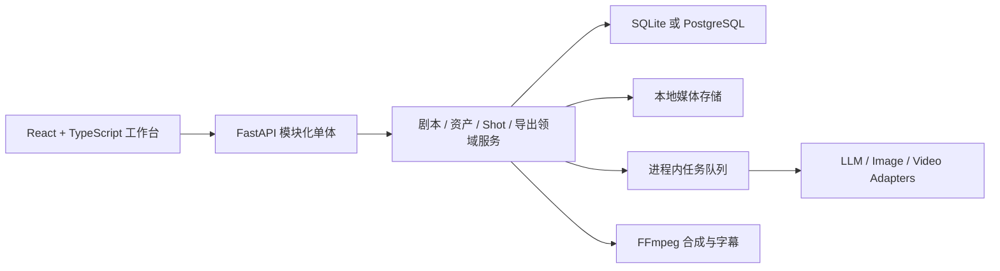

# VerbaScene · 语境片场

> 把一个创意，拍成一集会说英语的动画。

VerbaScene 是一个面向内部内容生产的 AIGC 工作台：将创意描述或已有剧本整理为可编辑的英语短剧剧本，管理角色与场景参考资产，生成视频片段，并通过 FFmpeg 导出单集成片。

项目默认使用 CEFR A1 英语，不限制受众年龄；目标成片为 1–3 分钟，默认 `16:9 / 854×480`，也支持 `9:16 / 480×854`。

## 原创动画样片 · 送你一个月亮

小狐狸想把月亮装进罐子，送给过生日的小兔。一份笨拙的礼物，让两个朋友重新发现陪伴的意义。

**1 分 58 秒 · Seedance 2.0 + FlashVSR 1.5× · 720p · 中英双语字幕 · 原生音效**

https://github.com/user-attachments/assets/898d8d0c-17f3-45dd-a427-5f552b1e0a59

[下载720p双语成品](https://github.com/xkm1652262991/VerbaScene/releases/download/demo-a-moon-for-you-seedance2-720p-20260911/a-moon-for-you.seedance2.r2.flashvsr-1.5x.bilingual.mp4) · [无字幕版](https://github.com/xkm1652262991/VerbaScene/releases/download/demo-a-moon-for-you-seedance2-720p-20260911/a-moon-for-you.seedance2.r2.flashvsr-1.5x.clean.mp4) · [中英双语SRT](https://github.com/xkm1652262991/VerbaScene/releases/download/demo-a-moon-for-you-seedance2-720p-20260911/a-moon-for-you.seedance2.r2.flashvsr-1.5x.bilingual.srt) · [剧本](docs/scripts/送你一个月亮-seedance2.md) · [制作记录](docs/demos/a-moon-for-you-seedance2-720p.md)

> 当前定位：可运行的单机工作台与工程验证项目，不是已经完成鉴权、分布式任务和多人协作的生产 SaaS。

## 为什么不是简单的模型套壳

系统处理的不只是一次生成请求，而是一条可编辑、可返工、可追溯的内容生产链路：

```text
创意描述 / 已有剧本
  → 结构化英语剧本与 Dialogue
  → 角色、场景、道具及状态变体
  → 参考图候选、采用版本与历史版本
  → 视频片段与内部镜头节拍
  → 可人工编辑的视频 Prompt
  → 视频候选、采用版本
  → 原生音轨 + 可选字幕的成片导出
```

核心设计取舍：

- **人工稿优先**：上游内容变化只标记 Prompt 可能过期，不自动覆盖人工修改。
- **局部返工**：单个资产状态、参考图、片段首帧或视频片段可以独立重生成。
- **版本可追溯**：候选、采用版本、历史版本、Prompt、Provider 和来源任务保持关联。
- **自由导航**：剧本、资产库和视频制作可自由进入；运行中只防止同一资源重复提交。
- **Provider 可替换**：LLM、图片和视频模型通过统一 Adapter 与能力描述接入。

## 当前实现

| 模块 | 已实现能力 |
| --- | --- |
| 剧本 | AI 创意与导入剧本两种入口；结构化剧本；A1 英文对白；可选中文释义；生成、审稿和定点修订记录 |
| 资产 | 角色、场景、道具；剧情状态变体；图片候选；采用/拒绝；历史版本；引用关系 |
| 视频制作 | Shot 与内部 beats；可编辑最终 Prompt；参考资产；可选显式首帧；视频候选与采用版本 |
| 任务 | 持久化任务记录；剧本与单镜头视频的进程内队列；同资源防重复提交；剧本检查点恢复 |
| 导出 | FFmpeg 拼接；保留视频原生音轨；无音轨片段补静音；无字幕、英文、中英双语三种模式 |
| 数据 | 默认 SQLite；可切换 PostgreSQL；Alembic 迁移；本地文件存储 |
| 模型 | Mock、OpenAI-compatible、DashScope、Gemini、ComfyUI、Seedance、LTX、Wan 等 Adapter 目录 |

“Adapter 已实现”“只读连通”“真实生成”和“完整成片验收”是不同结论。当前证据与尚未完成的验收见 [Demo 与验证证据](docs/25-demo-evidence.md)。

## 架构



当前任务队列用于单机运行，不是 Celery 或多实例分布式队列；当前工作流也没有使用 LangGraph。详细边界见 [当前架构](docs/21-current-architecture.md)。

## 技术栈

- 前端：React 18、TypeScript、Vite
- 后端：FastAPI、SQLAlchemy、Alembic、Pydantic
- 数据：SQLite（默认）、PostgreSQL（可选）
- 媒体：FFmpeg、ffprobe、本地文件存储
- 模型接入：Provider Adapter、运行时配置、Mock 合同验证
- 测试：Python `unittest`、前后端 OpenAPI 合同检查、前端类型检查与构建

## 本地启动

前置依赖：Python、Node.js、FFmpeg。

后端：

```bash
cp .env.example apps/api/.env
python -m venv apps/api/.venv
source apps/api/.venv/bin/activate
pip install -r apps/api/requirements.txt
cd apps/api
uvicorn app.main:app --reload --host 127.0.0.1 --port 8000
```

前端使用另一个终端：

```bash
cd apps/web
npm install
npm run dev
```

默认使用 Mock Provider，不会产生付费图片或视频请求。页面地址为 `http://127.0.0.1:5173`，API 文档为 `http://127.0.0.1:8000/docs`。

## 定向验证

```bash
cd apps/api
.venv/bin/python -m unittest \
  tests.test_animation_english_workflow \
  tests.test_export_service

cd ../web
npm run check:api-contract
npm run build
```

真实 Provider 调用不属于普通测试。完整测试、真实生成和成片验收必须分别报告，不能用 Mock 结果代替。

## 仓库结构

```text
apps/api/                 FastAPI API、领域服务、Adapter 和测试
apps/web/                 React 工作台
docs/                     当前产品合同、架构与接入说明
storage/                  本地运行数据（媒体和数据库默认不提交）
output/                   本地实验输出（默认不提交）
wan22_api_service/        可选 Wan 服务包装器
wan22_i2v_provider_service/ 可选 Provider 服务包装器
tools/                    可选模型服务工具与公开 submodule
```

## 项目状态与边界

当前已经具备可运行工作台、Mock 合同链路、真实 Provider Adapter 和短样片产物，但还不能描述为“生产就绪”：

- 已完成《送你一个月亮》118 秒最终修订版，复用参考图、Seedance 2.0 智能时长生成、局部剪辑、FlashVSR 720p后期、原生音轨与中英双语字幕；本次跳过 Reflexion，完整自动工作流和长期批量生产仍需另行验收。
- 任务队列为进程内线程队列，不支持多实例协调。
- 暂无登录、权限、配额、成本治理和受控媒体访问。
- 真实 Provider 的参考图消费、原生音频和失败恢复仍需逐个模型验收。
- `output/` 与 `storage/` 中包含本地实验产物，不作为 Git 仓库内容分发。

## 文档入口

- [文档导航](docs/README.md)
- [产品需求](docs/00-product-requirements.md)
- [用户工作流](docs/01-user-workflow.md)
- [数据模型](docs/02-data-model.md)
- [Provider Adapter](docs/04-provider-adapter.md)
- [生成流水线](docs/05-generation-pipeline.md)
- [FFmpeg 合成](docs/07-ffmpeg-composition.md)
- [当前架构](docs/21-current-architecture.md)
- [Demo 与验证证据](docs/25-demo-evidence.md)
