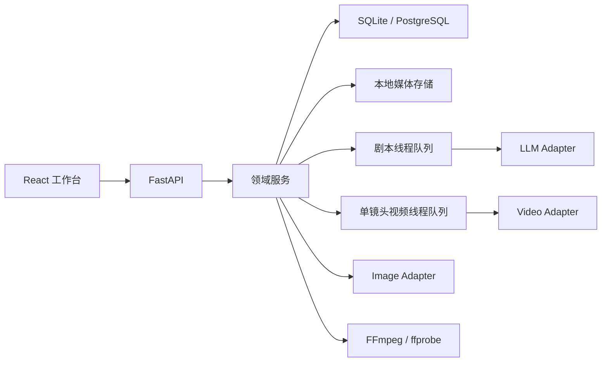

# 当前架构

本文描述当前代码，而不是最终设想。若本文与历史设计冲突，以当前代码和 `docs/api/openapi.json` 为准。

## 1. 运行结构

当前后端是模块化单体。SQLite、本地存储和进程内队列支持零基础设施单机运行；PostgreSQL 是共享数据库选项，但任务队列仍不是分布式的。

## 2. 工作区与领域对象

前端围绕三个可以自由进入的项目工作区组织：

- `script`：创意/导入原稿、结构化 Script、Dialogue 和生成轨迹。
- `assets`：角色、场景、道具、状态变体、参考图候选及历史版本。
- `production`：Shot、内部镜头节拍、最终视频 Prompt、引用资产、可选首帧和视频版本。

导出属于视频制作操作，同时以 `export` 分类记录运行审计，不是阻止用户进入其他工作区的阶段门禁。

核心持久化对象：

| 对象 | 职责 |
| --- | --- |
| `Project / Chapter` | 单集项目、创作输入和生产设置 |
| `Script / Dialogue` | 可编辑剧本版本、英文对白和可选中文释义 |
| `Character / Scene / Prop` | 剧情实体与可生成的结构化资产规格 |
| `Shot` | 可独立生成的视频片段及内部 beats |
| `AssetCandidate` | 待人工采用或拒绝的媒体候选 |
| `Asset` | 已采用媒体、历史版本和来源关系 |
| `GenerationTask` | Provider 或长任务的状态、进度、错误和输出 |
| `ProjectStageRun` | 按工作区记录的运行审计 |
| `Export` | 导出版本、字幕模式和最终媒体 |

## 3. 写入与状态语义

- 生成新的候选或版本，不直接覆盖历史媒体。
- 上游内容变化通过指纹判断下游 Prompt 是否可能过期。
- 只有用户主动重新编译 Prompt 才覆盖当前 Prompt 文本。
- 活动任务按资源范围防止重复提交，不锁定整个项目。
- 资产采用、拒绝、重生成和导出通过领域服务写入，路由只承担协议转换。

系统没有“上一阶段未确认就禁止浏览下一页”的全局门禁。Readiness 用于提示缺失输入和生成条件，不承担导航权限。

## 4. 任务执行

### 剧本队列

剧本生成创建持久化 `GenerationTask`，随后进入单个进程内工作线程。每次成功 LLM 调用后保存检查点；服务重启时，运行中任务会退回 `queued` 并从检查点继续。

### 视频队列

单镜头视频任务进入进程内线程队列，并按配置限制到最多两个工作线程。服务重启时，已在外部执行的任务会标记为中断，排队任务会重新调度。

### 当前限制

- 队列内存状态不在多个 API 实例间共享。
- Redis 当前不是任务队列。
- 没有 Celery 或 LangGraph worker。
- 运行中 Provider 请求不保证能够立即取消。
- 图片批量生成和 FFmpeg 导出仍可能同步占用 API 进程。

## 5. Provider Adapter

运行槽位为 `llm`、`image` 和 `video`。所有 Adapter 统一接收 `ProviderRequest`，返回任务状态、媒体、用量和规范化错误；descriptor 公开参考输入、原生音频、分辨率和时长等能力。

当前目录包含 Mock、OpenAI-compatible、DashScope、Gemini、ComfyUI、Seedance、LTX、Wan 等实现。目录注册、配置校验、只读连通与真实生成属于不同证据等级：

1. 注册只说明前端可以选择该 Adapter。
2. 配置校验只说明必填参数存在。
3. Provider test 只覆盖该次测试请求。
4. 只有真实主链路验收才能证明参考图、音频和输出落盘都符合产品合同。

直接输入的 Provider 密钥写入本机私有 secret 文件，读取接口只返回配置状态，不返回明文。

## 6. 持久化与媒体

- 默认结构化数据：`storage/local/content.sqlite3`。
- 默认媒体：`storage/projects/{project_id}/...`。
- SQLite 启动时执行本地版本升级与必要备份。
- PostgreSQL 使用 Alembic 迁移，不能把同一迁移历史直接应用到本地 SQLite。
- `/storage` 当前由 FastAPI 静态挂载，尚无鉴权或细粒度访问控制。

`storage/`、`output/`、`.env` 和运行时 secret 默认不提交 Git。

## 7. 导出

导出服务读取已采用的视频版本并通过 FFmpeg：

1. 统一片段尺寸、像素格式和音频格式。
2. 保留片段原生音轨。
3. 为无音轨片段生成等长静音。
4. 按 Shot 顺序拼接视频与音频。
5. 根据 `none | en | bilingual` 选择是否烧录 Dialogue 字幕。
6. 生成新的 Export 与最终视频 Asset，不覆盖历史版本。

字幕来自当前 Dialogue；`bilingual` 在英文下方增加非空中文释义。系统不再维护独立 TTS、单句音频或音效生成主链路。

## 8. 已知边界

- 当前最长本地真实成片证据约 32.5 秒，尚未完成 1–3 分钟当前合同验收。
- 没有登录、权限、多租户、配额或商业计费。
- SQLite 和本地媒体适合单机内部使用，不适合多实例并发写入。
- 尚无统一的分布式限流、成本预算和 Provider 熔断。
- 真实模型的角色一致性和参考图消费需要按 Provider 校准，不能由 Adapter 字段直接保证。

证据与对外陈述边界见 [25-demo-evidence.md](25-demo-evidence.md)。
