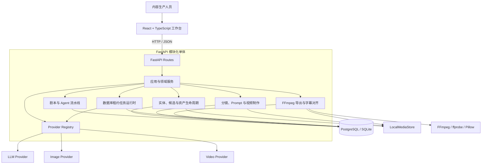
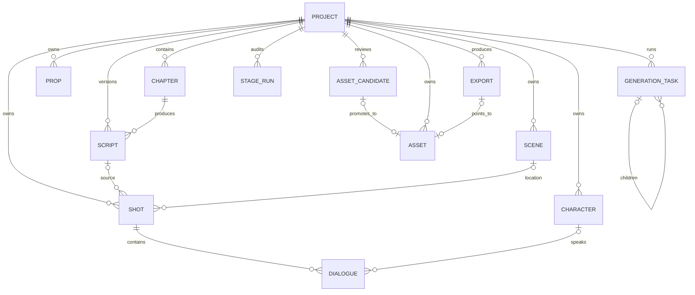
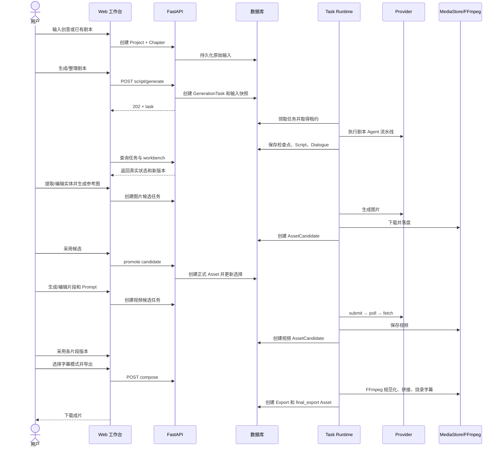
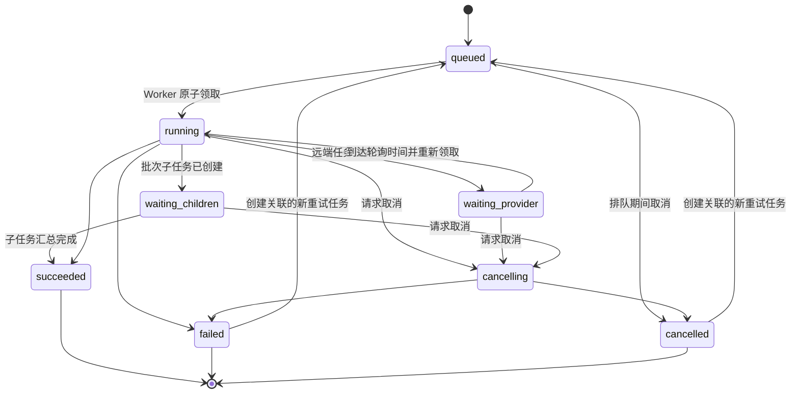
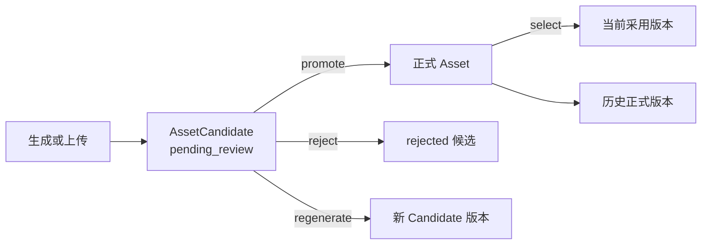
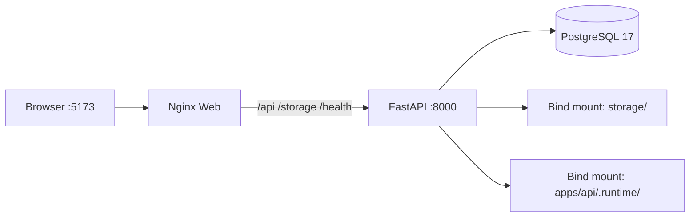

# VerbaScene（语境片场）系统技术设计文档

> 文档状态：当前实现基线（As-Is）
>
> 适用版本：`0.1.0`
>
> 更新日期：2026-09-05
>
> 适用读者：前端、后端、AI/Agent、测试、运维与技术评审人员

## 1. 文档目的

本文给出 VerbaScene 的综合技术设计，回答以下问题：

- 系统当前解决什么问题，边界在哪里；
- 前端、API、领域服务、任务运行时、Provider 和媒体处理如何协作；
- 核心数据、状态、版本和失败恢复遵循哪些不变量；
- 如何开发、部署、验证和排查系统；
- 当前实现距离共享部署或生产化还缺少什么。

本文描述的是当前代码，而不是远期愿景。事实优先级如下：

```text
当前代码与 OpenAPI 合同
  > 本文与“当前事实源”文档
  > 专题设计文档
  > 路线图与历史设想
```

公共接口的机器可读事实源是 [`api/openapi.json`](api/openapi.json)。

## 2. 系统概述

VerbaScene 是一个面向内部内容生产的动画风格启蒙英语短剧工作台。系统接收 AI 创意描述或已有剧本，生成并维护可编辑的英语剧本、角色与场景资产、视频片段和最终成片。

当前产品合同：

| 项目 | 当前约束 |
| --- | --- |
| 内容形态 | 单集动画英语短剧 |
| 输入 | AI 创意描述或已有剧本 |
| 英语级别 | 默认 CEFR A1，不使用受众年龄作为约束 |
| 时长 | 目标 1–3 分钟 |
| 默认画面 | `16:9`、`854x480` |
| 可选画面 | `9:16`、`480x854` |
| 音频 | 由视频模型生成原生对白与音效 |
| 字幕 | 默认不烧录；导出可选英文或中英双语 |
| 工作方式 | 剧本、资产库、视频制作可自由进入，人工编辑和采用优先 |

系统不是一次性的“Prompt → 视频”包装层，而是一条支持编辑、版本选择、局部返工、失败恢复和来源追踪的内容生产链路。

## 3. 设计目标与非目标

### 3.1 设计目标

- **人工可控**：AI 输出先成为可编辑内容或待审候选，不能静默覆盖人工稿。
- **局部返工**：角色图、场景图、片段首帧和片段视频可以单独重生成。
- **版本可追溯**：记录 Prompt、引用资产、Provider、模型、任务和采用关系。
- **Provider 可替换**：业务层依据能力合同调用模型，不依赖供应商名称分支。
- **失败可恢复**：长任务保存输入快照、远端任务 ID、检查点和错误语义。
- **单机可运行**：使用 SQLite、进程内 Worker 和本地文件系统即可启动。
- **可演进**：共享部署可切换 PostgreSQL，并为对象存储和分布式 Worker 保留边界。

### 3.2 当前非目标

- 多集、片头片尾、封面和高级时间线编辑；
- 独立 TTS、音色管理、单句重配音和独立音效生成；
- 用户登录、角色权限、多租户、配额和商业计费；
- 多 API 实例下的分布式任务调度；
- 自动训练角色 LoRA；
- 把所有已注册 Provider 都声明为已经完成真实生成验收。

## 4. 架构总览

### 4.1 逻辑架构



### 4.2 当前部署边界

当前后端是一个模块化单体，任务 Worker 与 API 运行在同一 Python 进程内。数据库是任务状态的真相源，线程和事件只负责领取与唤醒任务。

这意味着：

- 单进程重启后可以依据数据库中的任务状态恢复；
- 当前不能把它等同于 Celery、Redis 队列或多实例分布式调度系统；
- Redis 仅为可选依赖检查项，不是任务队列或任务真相源；
- 工作流使用领域服务和显式状态模型，没有使用 LangGraph。

### 4.3 核心架构决策

| 决策 | 当前选择 | 原因与影响 |
| --- | --- | --- |
| 服务形态 | 模块化单体 | 适合内部 MVP，降低部署和分布式一致性成本 |
| 工作流编排 | 领域服务 + 显式状态 | 生产步骤清晰，调试和恢复不依赖隐式 Agent 图 |
| 长任务 | 数据库租约 + 本地线程 | 支持单进程持久化恢复，同时保留迁移到外部 Worker 的可能 |
| 数据库 | PostgreSQL 推荐，SQLite 开发后备 | PostgreSQL 用于 Docker/共享环境；SQLite 提供零依赖开发体验 |
| 媒体存储 | 本地文件系统抽象 | 当前简单可控，后续可用同一接口迁移对象存储 |
| AI 接入 | Provider Adapter + 能力描述 | 避免业务代码绑定某一家模型供应商 |
| 生成结果 | Candidate → Review → Asset | 保留历史，避免不满意结果覆盖当前版本 |
| Prompt 更新 | 显式重新编译 | 上游变化只提示过期，保护人工编辑稿 |
| 音频 | 视频原生音轨 | 避免独立 TTS、音效和对口型链路的额外复杂度 |

## 5. 技术栈

| 层次 | 技术 |
| --- | --- |
| Web | React 18、TypeScript、Vite 5、原生 Fetch API |
| API | Python 3.12、FastAPI、Pydantic Settings |
| ORM 与迁移 | SQLAlchemy 2、Alembic |
| 数据库 | PostgreSQL 17（Docker 默认）、SQLite（本地模式） |
| 媒体 | FFmpeg、ffprobe、Pillow |
| 模型接入 | 自定义 Provider Adapter；同步、异步与轮询合同 |
| Web 服务 | Nginx（静态前端及 API/媒体反向代理） |
| 测试与合同 | Python `unittest`、OpenAPI 快照、TypeScript 编译、Vite 构建 |
| 交付 | Docker Compose、GitHub Actions |

## 6. 代码结构与职责

```text
apps/
  api/
    app/
      api/routes/          HTTP 路由与协议转换
      agents/              剧本、实体、分镜和 Prompt Agent/规则
      scripts/             剧本任务、检查点和持久化
      assets/              图片候选、批次与视频截帧任务
      production/          分镜导演、视频请求编译和视频候选任务
      exports/             成片任务、字幕对齐和导出合同
      services/            应用服务及跨模块领域操作
      platform/tasks/      统一任务仓储、租约、Worker 和状态机
      platform/media/      媒体存储与可取消子进程抽象
      providers/           Provider 合同、注册表与具体 Adapter
      models/              SQLAlchemy 持久化模型
      schemas/             Pydantic API Schema
      db/                  数据库引擎、会话和 SQLite 本地升级
      core/                配置、日志、错误和 OpenAPI 安装
    alembic/               PostgreSQL 迁移
    tests/                 后端合同与领域测试
  web/
    src/
      pages/               项目、任务和模型管理页面
      components/studio/   工作台组件
      services/            API 客户端
      types/               前端领域与 API 类型
      utils/               任务、脚本和资产辅助逻辑
docs/                      产品、架构、专题设计和 OpenAPI 快照
docker/                    API/Web 镜像、Nginx 和启动脚本
storage/                   本地数据库与项目媒体（运行时数据）
```

路由只负责参数校验、调用服务和返回协议；版本采用、资源去重、Prompt 编译和任务状态迁移等规则应保留在领域服务、任务仓储或专用编译器中。

## 7. 核心领域模型

### 7.1 关系概览



### 7.2 聚合与对象职责

| 对象 | 职责 |
| --- | --- |
| `Project` | 单集生产设置、风格、目标时长、画幅、导演记忆和当前状态 |
| `Chapter` | 保存 `ai_brief` 或 `imported_script` 原始输入 |
| `Script` | 可读正文和结构化场景/对白的版本化结果 |
| `Character / Scene / Prop` | 剧情实体、固定描述与结构化资产规格 |
| `Shot` | 一次可独立生成的视频片段；包含多个内部镜头节拍 |
| `Dialogue` | 英文对白、可选中文释义、说话人、情绪、音效和字幕时间 |
| `AssetCandidate` | 尚待采用或拒绝的图片、视频或截帧候选 |
| `Asset` | 已采用或上传的正式媒体版本 |
| `GenerationTask` | 后台任务的输入快照、状态、租约、结果、错误与父子关系 |
| `ProjectStageRun` | `script/assets/production/export` 工作区操作审计，不是任务真相源 |
| `Export` | 一次成片导出的规格、状态与最终资产引用 |
| `ProviderConfig` | 当前运行槽位的 Provider、模型、端点和默认参数 |
| `AgentConfig / PromptVersion` | 文本 Agent 覆盖配置和 Prompt 版本 |
| `QualityCheck` | 规则或模型质量检查结果及建议 |

### 7.3 数据表示

- 主键使用 36 字符 UUID，时间字段统一保存带时区时间。
- 跨数据库文档字段通过 `JSON_DOCUMENT` 表示：SQLite 使用 JSON，PostgreSQL 使用 JSONB。
- `shot_card`、`asset_spec`、Provider 参数、任务快照和原始响应使用 JSON 文档承载可演进结构。
- 稳定、需要查询或约束的状态、版本、外键和租约字段使用显式列。

### 7.4 关键数据不变量

1. `Project.style` 是视觉风格的事实源；兼容字段不能反向覆盖它。
2. `Shot` 是一次视频生成单元，内部 `beats` 是镜头推进，不是独立远端任务。
3. 英文对白由 `Dialogue.text` 保存，中文释义允许为空。
4. `variant_key` 表示同一实体的剧情状态，`version` 表示同一形象的重生成版本，两者不可混用。
5. 新候选不能直接覆盖正式资产；只有 `promote` 才创建或关联正式版本。
6. 每个业务槽位至多有一个当前选择，但历史资产和候选继续可追溯。
7. `GenerationTask` 是任务真相源；`ProjectStageRun` 只做操作审计。
8. 上游变化不删除下游内容，只更新过期提示或输入指纹。

## 8. 主生产流程



所有返回 `202` 的生成接口只表示“任务已受理”，不表示内容已经生成。前端必须等待任务进入 `succeeded`，再刷新聚合数据。

## 9. Agent 与确定性逻辑边界

### 9.1 剧本流水线

当前剧本生成不是单次自由文本调用，而是带结构合同和质量回路的流水线：

```text
原始输入
  → Story Blueprint
  → Script Draft
  → Script Review
  → 可选的定点 Patch
  → Contract Report
  → Script + Dialogue 持久化
```

- AI 创意模式侧重建立人物目标、阻碍、因果节拍和自然英语交流机会。
- 导入模式优先保留原作事件、人物关系、因果、结局和对白意图。
- Review 将问题分为 `must_fix` 和编辑建议；Patch 只能修改被授权的场景。
- 初稿不可解析时只允许一次保持内容语义的结构恢复。
- Review 不可用时可以降级保留有效稿，但必须记录 `review_unavailable`，不能伪装为通过。

### 9.2 实体与资产设计

实体提取将剧本转换为角色、场景和道具。角色和场景进入默认参考图链路；道具默认只保存结构化剧情数据。角色的临时情绪或动作状态通常写入片段 Prompt，不为每个瞬时状态生成一张独立角色图。

### 9.3 反思式分镜导演

分镜导演将完整故事规划为较长的连续叙事片段，每个 `Shot` 内包含多个 beats。当前流程包含草案、资产检查、审稿/Reflection、受限 Patch 和确定性合同校验。

Agent 负责叙事判断和片段总时长规划；程序负责：

- 校验外键、片段顺序、对白绑定和时长总和；
- 限制 Patch 只能触及授权片段；
- 生成稳定标识和输入指纹；
- 把自由输出转换为持久化结构；
- 在模型不可用或输出不合法时给出明确失败或降级状态。

### 9.4 Prompt 编译器

视频 Prompt 由确定性编译器将项目风格、引用资产、片段节拍、动作、英文对白、情绪和音效提示组合为最终稿。

关键规则：

- 引用媒体按实际发送顺序编号为“图片1、图片2……”；文字编号必须与 Provider payload 顺序一致。
- 默认最多使用 2 张角色图和 1 张场景图；只有用户明确启用时才增加片段首帧。
- 参考图已表达稳定外观时，Prompt 不重复整段资产百科。
- 英文对白、说话人、情绪、环境音和动作音效进入视频 Prompt。
- 画面必须禁止字幕、标题、气泡或其他可读文字；字幕只在导出阶段渲染。
- `Shot.video_prompt` 是实际发送稿。输入变化只标记 `prompt_stale`，只有用户主动重新编译才覆盖。

## 10. 后端 API 设计

### 10.1 接口风格

- 资源路径统一位于 `/api`，健康检查为 `/health`。
- 普通读取与写入使用同步 HTTP 响应。
- 剧本、分镜、图片、视频、截帧和导出使用异步任务接口，返回 `202 Accepted`。
- 列表接口使用 `offset/limit` 分页模型。
- 长任务支持 `Idempotency-Key`，活动资源同时使用服务端去重键。

成功响应：

```json
{
  "success": true,
  "data": {}
}
```

分页响应：

```json
{
  "success": true,
  "items": [],
  "meta": { "total": 0, "offset": 0, "limit": 100 }
}
```

错误响应：

```json
{
  "success": false,
  "error": {
    "code": "conflict",
    "message": "当前状态不允许执行这个操作。",
    "detail": null
  }
}
```

### 10.2 API 分组

| 分组 | 主要职责 |
| --- | --- |
| Projects | 创建、查询、编辑、删除预检、工作台聚合快照和变更影响预演 |
| Scripts / Dialogues | 剧本生成、当前剧本编辑、片段对白保存 |
| Entities | 角色、场景、道具提取、读取和编辑 |
| Assets / Candidates | 上传、生成候选、采用、拒绝、重生成、选择、截帧和删除 |
| Shots | 分镜生成、增删改排、引用绑定、Prompt 预览与重新编译 |
| Tasks | 列表、进度、详情、取消和人工重试 |
| Providers | Provider 目录、运行配置、图片配置档和连接测试 |
| Exports | 创建成片任务和读取导出历史 |
| Quality / Readiness | 质量检查与当前操作所需输入提示 |
| Agent / Prompt | Agent 覆盖配置和 Prompt 版本管理 |
| Workflow | 工作区运行审计读取与取消 |

`GET /api/projects/{project_id}/workbench` 是当前前端的主要聚合读取接口。它减少请求数量，但可能随项目资产增长而变重，不能长期承载大体积 base64 媒体。

### 10.3 合同维护

路由、Schema、错误结构或分页变化时必须：

1. 更新后端 Schema 与路由；
2. 重新导出 `docs/api/openapi.json`；
3. 执行后端 OpenAPI 一致性检查；
4. 更新前端类型/API 客户端；
5. 执行前端消费者合同检查。

## 11. 统一任务运行时

### 11.1 状态机



图中的终态到 `queued` 表示创建一条带 `retry_of_task_id` 的新任务；原失败或取消任务不会被重置。

活动状态：

```text
queued / running / waiting_provider / waiting_children / cancelling
```

终态：

```text
succeeded / failed / cancelled
```

### 11.2 任务通道

| Lane | 任务 | 默认并发 | 代码上限 |
| --- | --- | ---: | ---: |
| `script` | 剧本生成、分镜导演 | 2 | 4 |
| `image` | 单目标图片候选 | 2 | 2 |
| `video` | 单片段视频候选 | 2 | 2 |
| `media` | 视频截帧、FFmpeg 导出 | 1 | 1 |

图片和视频批次使用父任务 + 单资源子任务；父任务聚合 `child_summary`，不亲自执行 Provider 调用。

### 11.3 并发与一致性

- 创建任务时冻结输入到 `input_payload`，避免排队期间上游编辑改变本次执行。
- `active_dedupe_key` 的数据库唯一约束阻止同一业务资源并行提交。
- `(project_id, task_type, idempotency_key)` 唯一约束用于返回同一幂等请求的原任务。
- Worker 用条件更新领取任务，并写入 `lease_owner`、`lease_token`、`lease_expires_at` 和 `heartbeat_at`。
- 每次领取生成新 `lease_token`；旧 Worker 在提交事务前必须通过租约 fencing，失租后不能写入进度、终态或产物。
- Provider 调用、轮询、下载和 FFmpeg 执行期间不持有数据库长事务。
- 任务进入终态时清空活动去重键、租约和下次运行时间。

### 11.4 提交不确定性与恢复

Provider 调用区分三种提交状态：

| 状态 | 含义 | 恢复策略 |
| --- | --- | --- |
| `not_submitted` | 明确未被 Provider 受理 | 满足重试条件时可自动重试一次 |
| `accepted` | 已得到远端任务 ID | 保存 ID，重启后只轮询，不重新提交 |
| `unknown` | 请求可能已被受理但本地无可靠 ID | 以 `provider_submission_uncertain` 失败，禁止盲目重提 |

本地确定性任务（例如 FFmpeg 导出）可根据冻结快照安全重跑；付费 Provider 请求只有在明确未提交时才允许自动重试。失败或取消任务的人工重试会创建新任务并通过 `retry_of_task_id` 保留来源。

### 11.5 取消语义

- 排队任务可以直接取消。
- 已提交远端任务执行 Adapter 的尽力取消；供应商不保证立即停止。
- FFmpeg 子进程收到取消后终止进程并清理任务临时文件。
- 取消不会删除已有正式资产、历史候选或此前成功导出。

## 12. Provider Adapter

### 12.1 统一合同

所有 Adapter 继承 `ProviderAdapter`，统一接收 `ProviderRequest`，返回 `ProviderResponse`。

核心请求字段：

- `project_id`、`task_id`；
- `model`、`prompt`、可选 `system_prompt/negative_prompt`；
- 有序 `references`；
- Provider 参数和内部元数据。

核心响应字段：

- 规范化状态和执行模式；
- `provider_task_id` 与建议轮询间隔；
- 媒体列表、用量、原始响应；
- 规范化错误、可重试标志和提交状态。

### 12.2 能力协商

Provider descriptor 公开：

```text
native_audio
reference_images / reference_videos / reference_audio
multi_reference
smart_duration
min_duration_sec / max_duration_sec
supported_resolutions
supports_polling
```

业务层必须依据这些能力决定是否发送参考输入、固定时长和分辨率，不能以 `provider_name` 猜测能力，也不能静默丢弃用户要求。

### 12.3 运行时配置

系统有 `llm`、`image`、`video` 三个运行槽位：

- 环境变量提供启动默认值；
- `ProviderConfig` 可以保存运行时选择和非敏感参数；
- 直接输入的密钥写入 `PROVIDER_SECRET_FILE` 指向的本机私有文件；
- 读取配置只返回“是否已配置”，不回显密钥明文；
- 保存后重建注册表快照，当前 API 进程立即使用新配置。

当前代码目录包含 Mock、OpenAI-compatible、DashScope、Gemini、OpenAI Image、Custom HTTP、Qwen Image Musubi、ComfyUI Flux、Seedance 2、LTX 2.3、MiniMax H3 和 Wan I2V 等 Adapter。目录注册不等于配置完成，更不等于真实生成已验收。

### 12.4 证据等级

```text
Adapter 已注册
  < 配置校验通过
  < 只读连通通过
  < 单次真实生成通过
  < 当前产品主链路完整验收通过
```

测试报告必须使用准确等级，Mock 合同测试不能表述为真实模型生成成功。

## 13. 资产、候选与版本

### 13.1 生命周期



上传的图片可直接成为正式资产；模型生成默认先进入候选审核。采用新版本只改变当前选择，不物理覆盖旧文件。

### 13.2 资源身份

媒体槽位由以下维度共同确定：

```text
project_id
asset_type
asset_role
entity_type + entity_id
variant_key
version
```

- `asset_role` 区分角色设定图、场景图、分镜图、片段视频和最终导出等用途。
- `variant_key` 区分稳定剧情形态，例如场景的 `base` 与 `rainy`。
- `version` 只表示同一槽位的第几次生成或上传。
- `source_task_id`、`source_script_id`、`source_shot_batch_id` 和 Prompt/Provider 字段组成来源链。

### 13.3 媒体存储

`LocalMediaStore` 将媒体写入：

```text
storage/projects/{project_id}/{namespace}/{filename}
```

存储层会清洗路径段并校验解析后的路径仍位于 `STORAGE_ROOT` 内，避免目录逃逸。数据库保存公开 URI，业务代码通过 `MediaStore` 解析或写入文件，不应自行拼接磁盘绝对路径。

删除项目时先执行记录与活动任务预检；数据库删除完成后，项目媒体移动到回收目录。当前没有回收站恢复或清空 UI。

## 14. 视频生成与引用快照

单片段视频任务创建时冻结：

- 实际发送的 `Shot.video_prompt`；
- 参考资产 ID、精确版本和有序 URI；
- 是否显式使用首帧；
- Provider、模型及能力快照；
- 时长模式、分辨率和其他参数；
- 脚本与分镜批次来源。

异步视频 Adapter 按以下阶段执行：

```text
compile request
  → persist pre-submit checkpoint
  → submit
  → persist provider_task_id
  → poll
  → fetch result to temporary file
  → MediaStore 落盘
  → create AssetCandidate
  → finish task
```

项目批量生成只负责原子创建一个父任务和每个 Shot 的子任务；单个片段失败不会抹掉其他片段的成功候选。

## 15. 成片导出与字幕

导出任务在创建时冻结片段顺序、采用的视频版本、媒体 URI、实际时长、Dialogue 时间轴、分辨率和字幕模式。

FFmpeg 流程：

1. 按 `shot_no` 读取已采用片段；
2. 用 ffprobe 检查媒体和音轨；
3. 统一尺寸、像素格式、视频编码和音频格式；
4. 保留已有原生音轨，为无音轨片段补等长静音；
5. 拼接标准化后的片段；
6. 按 `none | en | bilingual` 决定是否叠加字幕；
7. 创建版本化 `final_export` Asset 和 Export 审计。

字幕时间优先级：

```text
人工 start/end
  > 可选 ASR 对齐
  > beat/片段位置 + 阅读时长启发式
```

ASR 只用于时间定位，不能覆盖已确认的 Dialogue 文本。ASR 失败、低置信度或无音轨时，单条对白降级到确定性时间规则，不阻断整个导出。字幕由 Pillow 渲染为透明图片后交给 FFmpeg 叠加，以显式控制中英文字体覆盖。

导出 manifest 记录片段版本、音轨处理、字幕模式、Dialogue ID、字幕时间来源和降级原因。

## 16. 前端设计

### 16.1 页面与导航

当前前端使用轻量 Hash 路由：

```text
#/projects                              项目列表与创建入口
#/projects/{project_id}                 项目工作台
#/projects/{project_id}/chapter         剧本视图
#/projects/{project_id}/assets          资产视图
#/projects/{project_id}/assets/generate 集中资产图生成
#/projects/{project_id}/shots/{shot_id} 单片段定位
#/tasks                                 任务中心
#/models                                模型管理
```

项目工作台围绕剧本、资产库和视频制作组织。Readiness 只提示当前动作缺什么输入，不作为跨页面导航门禁。

### 16.2 数据同步

- 初次加载以 `/workbench` 聚合快照为主。
- 后台任务通过 `/api/tasks` 和 `/api/tasks/progress` 查询真实状态。
- 存在活动任务时加快轮询，空闲时降频。
- 任务成功后刷新 workbench；失败或取消不覆盖已有内容。
- `202` 仅创建任务，前端不自行模拟 Provider 或 FFmpeg 成功状态。
- 同一资源存在活动任务时禁用重复提交，其他资源和工作区保持可编辑。
- 剧本、Prompt、对白或镜头草稿的本地编辑不应因后台轮询失败而丢失。

### 16.3 当前前端边界

- 未引入专用路由、请求缓存或全局状态框架；
- 项目主工作台状态集中，后续功能增加会提高维护成本；
- 前端类型目前为手工维护，并通过 OpenAPI 路径合同检查防止明显漂移；
- 聚合接口可能携带较大媒体字段，需要在项目规模扩大前拆分轻量元数据和按需媒体加载。

## 17. 持久化与迁移

### 17.1 SQLite 本地模式

默认用于原生开发：

```env
PERSISTENCE_MODE=local
DATABASE_URL=
LOCAL_DATA_DIR=../../storage/local
LOCAL_DATABASE_FILENAME=content.sqlite3
```

SQLite 启用外键、WAL 和 busy timeout。应用启动时创建缺失表，并通过版本化本地迁移补齐历史结构；涉及破坏性升级时先在数据库同目录备份。

### 17.2 PostgreSQL 模式

Docker Compose 默认使用 PostgreSQL 17。结构由 Alembic 管理：

```bash
cd apps/api
.venv/bin/alembic upgrade head
```

`DATABASE_SCHEMA` 可用于 schema 隔离，只允许字母、数字和下划线。PostgreSQL 的 Alembic 历史不能直接用于 SQLite 文件。

### 17.3 事务原则

- 在短事务中创建任务和冻结输入；
- 在数据库事务外执行模型请求、网络下载和 FFmpeg；
- 用新短事务写入检查点、候选、正式资产和终态；
- 任务写入通过租约 fencing 防止过期 Worker 提交；
- 批次父子任务的创建和资源冲突检查应保持原子性。

## 18. 配置与部署

### 18.1 本地原生开发

```bash
cp .env.example apps/api/.env
python -m venv apps/api/.venv
source apps/api/.venv/bin/activate
pip install -r apps/api/requirements.txt
cd apps/api
uvicorn app.main:app --reload --host 127.0.0.1 --port 8000
```

另一个终端启动前端：

```bash
cd apps/web
npm install
npm run dev
```

默认 Mock Provider 不产生付费生成请求。

### 18.2 Docker Compose

```bash
./docker/up.sh
```



- Nginx 托管前端静态文件，并反向代理 API、媒体和文档端点。
- PostgreSQL 数据保存在 Compose 命名卷。
- 项目媒体保存在仓库 `storage/` 的 bind mount。
- 运行时 Provider 密钥保存在 `apps/api/.runtime/` 的 bind mount。
- 默认只绑定 `127.0.0.1`，不应在没有安全层时改为公网监听。
- `docker compose down` 保留数据；增加 `--volumes` 会删除数据库卷，应谨慎执行。

### 18.3 配置分组

| 分组 | 代表变量 |
| --- | --- |
| 服务 | `APP_ENV`、`DEBUG`、`LOG_LEVEL`、`CORS_ORIGINS` |
| 数据 | `PERSISTENCE_MODE`、`DATABASE_URL`、`DATABASE_SCHEMA` |
| 媒体 | `STORAGE_ROOT`、`PUBLIC_STORAGE_BASE_URL`、`FFMPEG_PATH` |
| 任务 | `*_GENERATION_CONCURRENCY`、`TASK_LEASE_SEC`、`TASK_HEARTBEAT_SEC` |
| Provider | `LLM_*`、`IMAGE_*`、`VIDEO_*` 及具体 Adapter 前缀 |
| 字幕 | `SUBTITLE_FONT_PATH`、`ASR_*` |
| 密钥 | `PROVIDER_SECRET_FILE` 和各 Provider API Key |

配置文件只放默认值或示例，真实密钥、内网地址和运行时 secret 文件不得提交 Git。

## 19. 安全设计与当前风险

### 19.1 已有保护

- CORS 来源由配置显式控制；
- Provider 密钥读取接口不回显明文；
- 媒体路径解析限制在 `STORAGE_ROOT` 内；
- 上传接口校验媒体类型和目标实体；
- 项目删除前检查活动任务和关联记录；
- 任务输入与原始响应会压缩审计载荷，避免无界保存大字段。

### 19.2 未完成的安全能力

当前没有身份认证、资源授权、多租户隔离、请求配额、Provider 成本上限或受控媒体访问。`/storage` 由 FastAPI 静态暴露，只适用于本机或可信内网。

在任何公网或多人共享部署前，至少需要补齐：

1. 用户认证和项目级授权；
2. 媒体签名 URL 或受权下载端点；
3. Provider 调用限流、预算、熔断和审计；
4. 密钥托管、轮换和文件权限校验；
5. 上传大小、格式、内容和恶意文件检查；
6. 数据备份、恢复演练和保留策略。

## 20. 可观测性与故障排查

### 20.1 当前能力

- `/health` 检查数据库，并按 `REDIS_REQUIRED` 决定 Redis 故障是否影响整体状态；
- 标准输出日志包含时间、级别、logger 名称和消息；
- `GenerationTask` 保存进度、错误码、错误信息、Provider 原始摘要、开始/结束时间和上下文关联；
- 任务中心展示父子汇总、资源键、失败原因，并支持取消和允许范围内的人工重试；
- Asset/AssetCandidate/Export manifest 保存来源、参数和媒体处理记录；
- `ProjectStageRun` 保存工作区动作审计。

### 20.2 排查顺序

```text
1. /health 与容器状态
2. GenerationTask 状态、错误码、租约和 provider_task_id
3. 父子任务 child_summary 与 resource_key
4. Provider 配置状态和能力快照
5. AssetCandidate / Asset 来源链与本地文件
6. FFmpeg/ASR manifest 和任务日志
```

不要在 `provider_submission_uncertain` 时直接重新提交同一付费请求；应先到 Provider 侧确认是否已经创建远端任务。

### 20.3 当前缺口

系统尚无统一指标、分布式 Trace、集中日志、成本告警、任务积压告警和 Provider SLO。共享部署前应至少增加任务成功率/延迟、队列年龄、租约恢复次数、Provider 错误率和单项目成本指标。

## 21. 测试与验证策略

### 21.1 验证分层

| 层级 | 目标 | 是否调用真实生成 |
| --- | --- | --- |
| 领域/服务定向测试 | 验证本次改动的规则与回归 | 否，默认 Mock |
| Provider 合同测试 | 验证请求映射、状态和错误归一化 | 否，使用 mock HTTP |
| OpenAPI 合同 | 保证后端快照和前端消费者路径一致 | 否 |
| 前端构建 | TypeScript 类型与生产构建 | 否 |
| 全量自动化测试 | 跨共享模块或公共合同改动后的回归 | 否，除非测试显式隔离 |
| 只读连通 | 验证端点、鉴权或模型目录可访问 | 否 |
| 真实生成 | 验证某 Provider 返回可解码媒体 | 是，需明确授权 |
| 完整成片验收 | 验证当前产品合同下的主链路和返工 | 是，需明确授权 |

默认只运行与改动直接相关的定向测试。同一项验证通过且相关代码未再变化时不重复执行。公共 API、数据库结构、共享任务运行时或跨模块重构才需要扩大到全量测试。

### 21.2 常用命令

后端定向测试示例：

```bash
cd apps/api
.venv/bin/python -m unittest \
  tests.test_animation_english_workflow \
  tests.test_export_service
```

OpenAPI 合同：

```bash
cd apps/api
.venv/bin/python scripts/export_openapi.py
.venv/bin/python scripts/check_openapi_contract.py

cd ../web
npm run check:api-contract
```

前端构建：

```bash
cd apps/web
npm run build
```

满足全量测试门槛时：

```bash
cd apps/api
.venv/bin/python -m unittest discover -s tests -v
```

真实 Provider 调用不属于常规自动化验证，不能为了“测试 Adapter”自动发起付费图片或视频任务。

## 22. 当前限制与演进建议

### 22.1 已确认限制

- 当前最长真实成片证据约 32.5 秒，尚未完成 1–3 分钟产品合同验收；
- 本地 Worker 尚未完成多 API 实例并发和故障切换验证；
- `/workbench` 聚合响应在资产增多后可能过大；
- Hash 路由、手写 API 类型和集中式项目页面会随功能增长提高维护成本；
- Provider 能力声明与真实效果之间仍需逐模型验收；
- 角色一致性、参考图消费和原生音频质量不能仅由 Adapter 字段保证；
- 无统一的成本控制、限流、熔断、指标和告警；
- 无登录、权限和受控媒体访问。

### 22.2 建议演进顺序

1. **完成真实主链路验收**：制作原创 60–90 秒样片，记录成功率、人工返工、耗时和成本。
2. **轻量化读取模型**：拆分 workbench 元数据与媒体加载，禁止聚合返回大体积 base64。
3. **补齐安全边界**：认证、授权、媒体访问、配额、成本预算和审计。
4. **增强可观测性**：结构化日志、Metrics、Trace、Provider SLO 和任务积压告警。
5. **外置任务执行**：在多人或多实例需求被证明后，将现有 TaskHandler 合同迁移到独立 Worker；数据库仍保留状态真相源。
6. **对象存储**：实现 S3/MinIO 版 MediaStore，并增加生命周期和签名 URL。
7. **前端模块化**：按工作区拆分状态和请求缓存，再评估正式路由与状态管理库。

不建议在缺少真实复杂度证据时先引入 LangGraph 或大规模微服务拆分；当前更重要的是稳定任务语义、真实 Provider 验收和安全边界。

## 23. 变更检查清单

### 23.1 修改领域模型或数据库

- 是否保持候选、正式资产和历史版本语义；
- 是否同时覆盖 SQLite 本地升级与 PostgreSQL Alembic 迁移；
- 是否检查级联删除、旧数据默认值和回滚/备份策略；
- 是否更新 Schema、OpenAPI 和对应文档；
- 是否需要扩大到全量测试。

### 23.2 新增 Provider

- 是否只通过 Adapter 接入，没有在业务层硬编码供应商名称；
- 是否准确声明参考输入、原生音频、时长和分辨率能力；
- 是否区分同步、异步、轮询和取消语义；
- 是否正确表达 `not_submitted/accepted/unknown`；
- 是否先完成 mock 合同测试，再由用户授权真实生成；
- 是否记录 Adapter、连通、真实生成和完整验收的不同证据等级。

### 23.3 新增长任务

- 是否在创建时冻结输入；
- 是否定义 `resource_key`、`active_dedupe_key` 和幂等范围；
- 是否选择正确 Lane 和并发上限；
- 是否避免在外部调用期间持有数据库事务；
- 是否使用租约 token fencing 写入进度与终态；
- 是否定义取消、自动重试、人工重试和重启恢复语义；
- 是否避免不确定状态下重复付费提交。

### 23.4 修改前端生成流程

- 是否把 `202` 显示为“已受理”而不是“已完成”；
- 是否只锁定同一资源，不锁定整个项目；
- 是否在成功后刷新真实数据，失败后保留旧版本；
- 是否保护未保存草稿；
- 是否同步前端类型、OpenAPI 路径检查和构建验证。

## 24. 相关文档

- [产品需求](00-product-requirements.md)
- [用户工作流](01-user-workflow.md)
- [数据模型](02-data-model.md)
- [Agent 设计](03-agent-design.md)
- [Provider Adapter](04-provider-adapter.md)
- [生成流水线](05-generation-pipeline.md)
- [评审与重生成](06-review-and-regeneration.md)
- [FFmpeg 合成](07-ffmpeg-composition.md)
- [前端工作台](08-frontend-workbench.md)
- [API 设计](09-api-design.md)
- [部署](10-deployment.md)
- [资产管理](12-asset-management.md)
- [当前架构](21-current-architecture.md)
- [Demo 与验证证据](25-demo-evidence.md)
- [后端任务运行时](26-backend-task-runtime.md)
- [反思式分镜导演 Agent](28-反思式分镜导演Agent.md)
