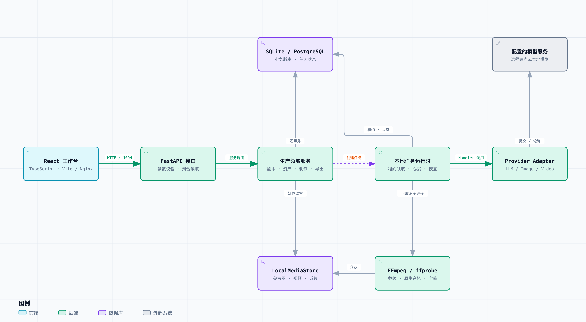
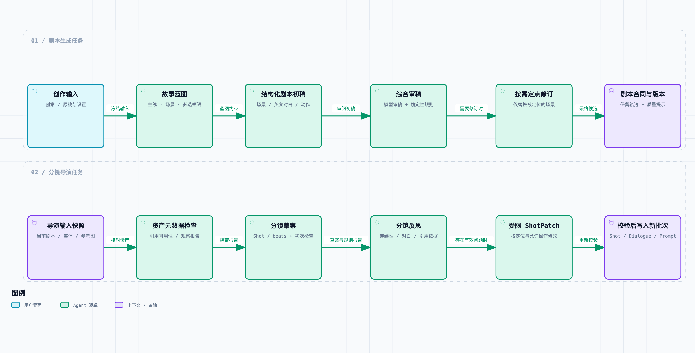
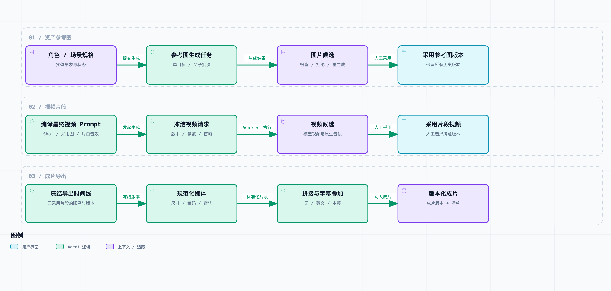
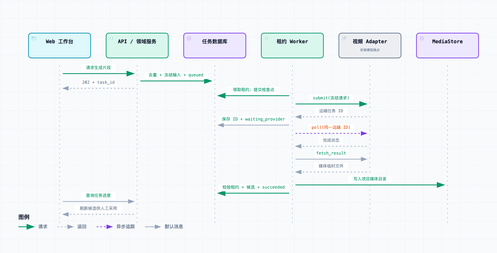
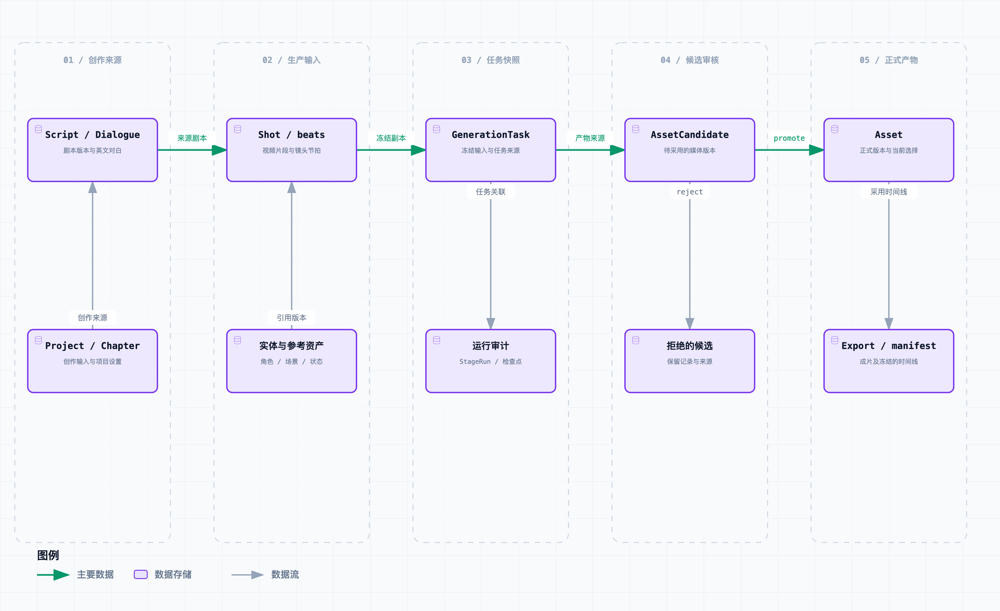
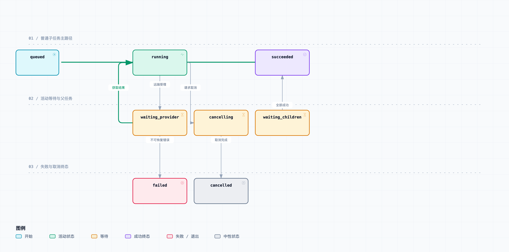

# VerbaScene 架构与生产图集

这组图使用 [Archify](https://github.com/tt-a1i/archify) 生成，依据代码快照 [`6929b68`](https://github.com/xkm1652262991/VerbaScene/commit/6929b68d389f7f12454d90849461c3b7c4746e16) 与当前设计文档，描述已实现的单机生产工具。绘制日期：2026-09-11；工具：Archify Skill 2.17。

在 GitHub 上直接阅读本页图片；克隆或下载仓库后，用浏览器打开 [index.html](index.html) 浏览交互图集。GitHub 文件页面显示 HTML 源码，下载后打开才能使用缩放、节点搜索、关系追踪、深浅主题和导出功能。

## 阅读顺序与文件

| 图 | 关注的问题 | 查看与编辑 |
| --- | --- | --- |
| 01 系统运行架构 | 前端、API、领域服务、Worker、模型与存储如何协作 | [PNG](01-system-architecture.png) · [SVG](01-system-architecture.svg) · [HTML](01-system-architecture.html) · [JSON](01-system-architecture.json) |
| 02 剧本与反思式分镜 | 蓝图、初稿、审稿、定点修订和生产合同如何组合 | [PNG](02-creative-pipelines.png) · [SVG](02-creative-pipelines.svg) · [HTML](02-creative-pipelines.html) · [JSON](02-creative-pipelines.json) |
| 03 媒体生产与导出 | 从参考图候选、采用版本到视频与最终成片 | [PNG](03-media-production.png) · [SVG](03-media-production.svg) · [HTML](03-media-production.html) · [JSON](03-media-production.json) |
| 04 异步视频时序 | 接受请求、持久化、提交、轮询、下载与候选写入 | [PNG](04-video-task-sequence.png) · [SVG](04-video-task-sequence.svg) · [HTML](04-video-task-sequence.html) · [JSON](04-video-task-sequence.json) |
| 05 资产来源与版本 | 输入、任务、候选、正式资产与导出的来源链 | [PNG](05-asset-lineage.png) · [SVG](05-asset-lineage.svg) · [HTML](05-asset-lineage.html) · [JSON](05-asset-lineage.json) |
| 06 任务状态与恢复 | 正常执行、等待、取消、失败与父任务的边界 | [PNG](06-task-lifecycle.png) · [SVG](06-task-lifecycle.svg) · [HTML](06-task-lifecycle.html) · [JSON](06-task-lifecycle.json) |

JSON 是可编辑的事实与布局源；HTML 是经过校验的交互产物；PNG 为浅色静态图；SVG 是可缩放的双主题矢量导出。说明卡片保留在 HTML 与本页文字中，PNG/SVG 由 Archify 的整图导出菜单生成。

## 01 · 系统运行架构



React 工作台通过 HTTP 调用 FastAPI；领域服务管理剧本、资产、制作和导出；耗时操作交给同一 API 进程内的任务运行时。数据库同时保存业务版本与 `GenerationTask`，进程内事件仅用于唤醒。图中的领域服务、Worker 与 Adapter 是代码职责，不代表独立部署的微服务。

原生开发使用 SQLite，Docker Compose 默认 PostgreSQL 17 与 Nginx。本地媒体由 `LocalMediaStore` 管理，FFmpeg/ffprobe 承担截帧、媒体规范化与合成。Provider 以能力合同处理参考输入、时长、分辨率和原生音频。

当前代码的文本通道默认并发为 **2**，运行时限制在 **1–4**；图片与视频通道最高为 **2**，本地媒体通道固定为 **1**。旧架构文档中“文本固定为 1”的描述已滞后，本图以代码为准。当前仍以单 API 进程为部署边界，未把 Redis、Celery、LangGraph、对象存储或身份认证画成已实现能力。

代码依据：[应用生命周期与媒体挂载](../../../apps/api/app/main.py)、[任务 Handler 注册](../../../apps/api/app/platform/tasks/defaults.py)、[Worker 与通道](../../../apps/api/app/platform/tasks/runtime.py)、[并发配置](../../../apps/api/app/core/config.py)、[Adapter 合同](../../../apps/api/app/providers/base.py)、[Compose](../../../compose.yaml)。架构 HTML 的来源标记另外绑定了 16 个经 Git 修订验证的代码引用。

## 02 · 剧本与反思式分镜



上行是剧本任务：创作输入 → 故事蓝图 → 结构化初稿 → 审稿 → 按需定点修订 → 合同报告与剧本版本。下行是用户另行发起的分镜导演任务：当前输入快照 → 资产元数据检查 → 分镜草案 → Reflection → 受限 ShotPatch → 最终合同校验与新批次写入。

需要区分三个实现细节：

- 资产检查当前由 `MetadataAssetInspector` 执行，`inspection_level` 为 `metadata_only`；它检查引用与媒体元数据，不代表模型已经分析图像像素。
- 两条链路都可以保留有效初稿：无修订需要时跳过 Patch；审稿不可用或 Patch 无效时按对应合同降级。初稿解析失败会尝试结构恢复，恢复仍失败则终止。
- 每个模型调用前后记录检查点；分镜最终合同无效时失败，旧批次保持不变。图中线性修订节点表示“按需处理”，不是每次都调用修订模型。

代码依据：[剧本流水线](../../../apps/api/app/agents/script_pipeline.py)、[剧本持久化](../../../apps/api/app/scripts/service.py)、[分镜服务](../../../apps/api/app/production/shot_direction/service.py)、[元数据检查](../../../apps/api/app/production/shot_direction/asset_inspector.py)、[分镜流水线](../../../apps/api/app/production/shot_direction/pipeline.py)、[受限 Patch 合同](../../../apps/api/app/production/shot_direction/contracts.py)。

## 03 · 媒体生产与成片导出



三行分别是可独立发起、可局部返工的生产动作：生成参考图并采用版本；使用 Shot、参考资产、英文对白和音效提示生成视频候选；按已采用视频创建导出。上一行的采用结果成为下一行的输入，工作区仍可自由导航。

默认视频路径使用角色/场景参考图和文本；片段首帧只有用户显式选择才发送。模型媒体先成为候选，人工采用后才进入正式版本；上传图片也可直接成为正式资产。道具默认保留结构化剧情数据。上游变化只提示 Prompt 可能过期，不覆盖人工文本。

导出冻结视频顺序、版本、时长、对白时间线和字幕模式。FFmpeg 保留原生音轨，对无音轨片段补等长静音；字幕可选 `none / en / bilingual`。时间定位优先级为人工时间 > 可选 ASR > 确定性规则，ASR 不覆盖已确认的对白文本。没有独立 TTS 或音效生成链路。

代码依据：[图片任务](../../../apps/api/app/assets/image_tasks.py)、[候选生命周期](../../../apps/api/app/services/asset_lifecycle_service.py)、[视频请求编译](../../../apps/api/app/production/video_request_compiler.py)、[导出快照](../../../apps/api/app/exports/export_tasks.py)、[导出执行](../../../apps/api/app/exports/task_handler.py)、[字幕对齐](../../../apps/api/app/exports/subtitle_alignment.py)、[合成实现](../../../apps/api/app/agents/composition.py)。

## 04 · 异步视频任务时序



图示支持异步轮询的视频 Adapter 的成功路径。API 创建任务后返回 `202`；Worker 原子领取租约，写入提交前检查点，再调用 `submit`。拿到远端任务 ID 后立即持久化，之后按 `available_at` 再领取并调用 `poll`；成功后 `fetch_result`、落盘、写入候选并完成任务。前端查询数据库中的真实状态，任务成功不等于候选已经被人工采用。

“领取租约；提交检查点”压缩展示了两次相邻的数据库操作，不表示在同一个长事务中等待模型。省略了重复轮询及查询的返回消息；Provider 调用、下载和 FFmpeg 不持有数据库长事务。任务状态的其他分支见第 06 图。

代码依据：[任务创建](../../../apps/api/app/production/video_tasks.py)、[视频 Handler](../../../apps/api/app/production/video_task_handler.py)、[下载与媒体落盘](../../../apps/api/app/production/video_provider_executor.py)、[候选结果写入](../../../apps/api/app/production/video_candidate_persistence.py)、[租约 fencing](../../../apps/api/app/platform/tasks/lease.py)。

## 05 · 资产来源与版本关系



这张图展示数据来源及版本流转，不是完整 ER 图。`Project/Chapter` 保留创作输入，`Script/Dialogue` 承载文本版本，`Shot` 引用剧本、实体与资产。生成任务冻结请求；产物候选沿 `source_task_id / source_script_id / source_shot_batch_id` 保留来源。

`promote` 创建或关联正式 Asset，`select` 改变当前选择；拒绝、重生成和采用都保留历史。`variant_key` 表示剧情状态，`version` 表示同一槽位的生成次数。导出快照引用精确片段版本，`Export/manifest` 记录成片来源。`ProjectStageRun` 是工作区操作审计，任务状态仍以 `GenerationTask` 为准。

代码依据：[内容模型](../../../apps/api/app/models/content.py)、[资产、候选、任务与导出模型](../../../apps/api/app/models/asset.py)、[工作区审计](../../../apps/api/app/models/workflow.py)、[资产解析](../../../apps/api/app/services/asset_resolver_service.py)、[媒体存储](../../../apps/api/app/platform/media/store.py)。

## 06 · 任务状态与恢复边界



图中主轨为普通任务的 `queued → running → succeeded`。下方展示常见等待与终止分支；`waiting_children` 可直接作为批次父任务的初始状态，因此不强行连接为普通子任务的必经阶段。主轨未重复标注箭头文字，状态顺序与下面的表格给出其含义。

| 状态 / 机制 | 当前语义 |
| --- | --- |
| `queued` | 等待领取；用户取消可直接进入 `cancelled` |
| `running` | 执行当前检查点；错误可直接进入 `failed` |
| `waiting_provider` | 保留远端 ID，等待下一次轮询；获取结果时回到 `running` |
| `waiting_children` | 父任务等待并汇总子任务，最终可成功、失败或取消 |
| `cancelling` | 停止本地执行或尝试远端取消；远端不保证立即停止 |
| `succeeded / failed / cancelled` | 终态；清空活动去重键、租约与下次运行时间 |
| 资源级去重 | `active_dedupe_key` 防止同一资源并发提交 |
| 请求幂等 | 按项目、任务类型和 `Idempotency-Key` 返回原任务 |
| 租约恢复 | 只恢复过期租约；每次领取更新 token，旧 Worker 不能写入 |
| `accepted` | 有远端任务 ID，恢复后继续轮询，不重新提交 |
| `unknown` | 可能已被受理但无可靠 ID，失败为 `provider_submission_uncertain` |
| `not_submitted` | 明确未受理，满足重试条件和配置时可自动重试一次 |
| 人工重试 | 为失败/取消任务创建新任务，以 `retry_of_task_id` 关联来源 |

本地确定性媒体任务可根据冻结输入安全重跑。图示是主要迁移的说明图，表格补充排队取消、运行失败和父任务汇总等未逐条展开的边。

代码依据：[状态与通道](../../../apps/api/app/platform/tasks/types.py)、[任务仓储](../../../apps/api/app/platform/tasks/repository.py)、[执行与恢复](../../../apps/api/app/platform/tasks/runtime.py)、[父子视频批次](../../../apps/api/app/production/video_batch_coordinator.py)。

## 校验与更新

每张图都经过 Archify `showcase` 的 **9/9 结构与构图检查，0 错误、0 警告**。浏览器检查覆盖 1440×900、1600×1000、1920×1080、2048×1320，并检查端点尺寸的浅色/深色主题。截图视觉复核、交互检查和 PNG/SVG 导出检查单独记录，详见 [acceptance.json](acceptance.json)。这些是图集检查，不代表应用全量测试或真实模型生成验收。

更新 JSON 后，使用已安装的 Archify 包执行以下命令。以下示例从仓库根目录运行，`ARCHIFY_ROOT` 指向包内含 `bin/archify.mjs` 的目录；架构来源校验要求检出的 `origin` 与 JSON 中的 GitHub 地址一致，可用 `ARCHIFY_REPO_ROOT` 指向对应 GitHub 检出。

```bash
export ARCHIFY_ROOT=/path/to/archify
export ARCHIFY_REPO_ROOT=/path/to/github/VerbaScene

node "$ARCHIFY_ROOT/bin/archify.mjs" validate architecture \
  docs/diagrams/archify/01-system-architecture.json \
  --repo-root "$ARCHIFY_REPO_ROOT" --quality showcase --json

node "$ARCHIFY_ROOT/bin/archify.mjs" deliver architecture \
  docs/diagrams/archify/01-system-architecture.json \
  docs/diagrams/archify/01-system-architecture.html \
  --repo-root "$ARCHIFY_REPO_ROOT" --quality showcase --json

node "$ARCHIFY_ROOT/bin/archify.mjs" visual-check \
  docs/diagrams/archify/01-system-architecture.html --json
```

其他图按 JSON 中的 `diagram_type` 使用 `workflow / sequence / dataflow / lifecycle`，不传 `--repo-root`。打开新 HTML 后通过“导出”菜单更新 PNG 与 SVG，并重新记录产物哈希和视觉复核结果。不要直接修改已校验 HTML 来调整图形。

需要依据更新后的代码时，先核对事实，再更新架构 JSON 的 `meta.repository.revision` 与本页快照链接。交互文件的查看器代码来自 Archify，许可证见 [ARCHIFY-LICENSE.txt](ARCHIFY-LICENSE.txt)。
